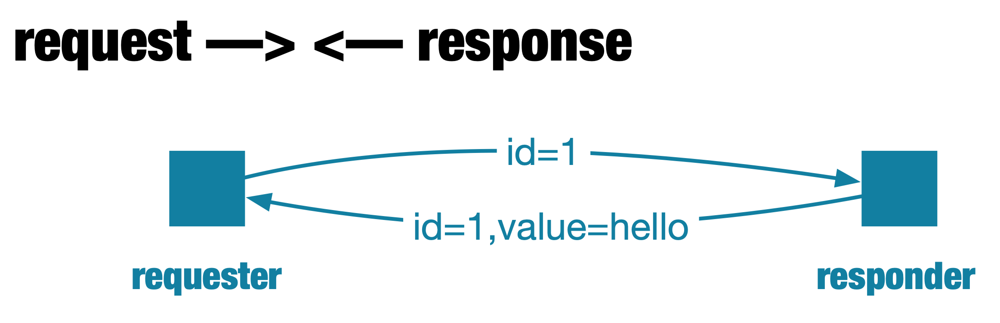
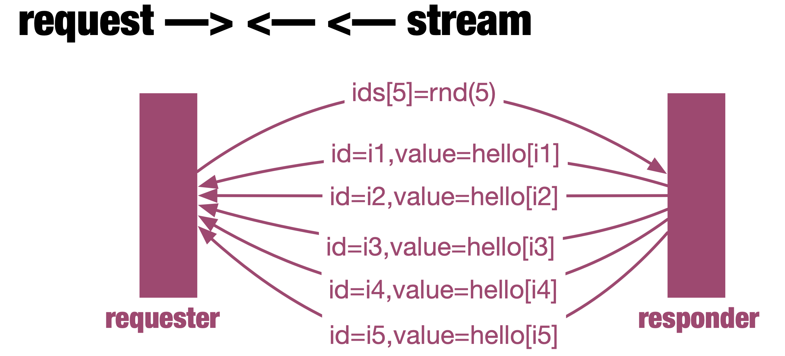
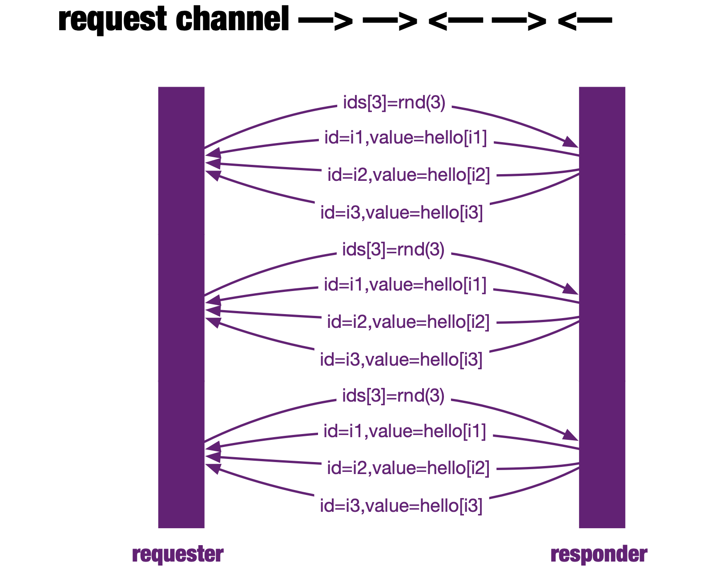
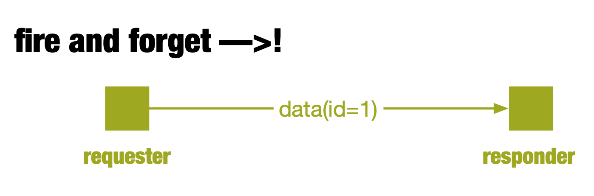
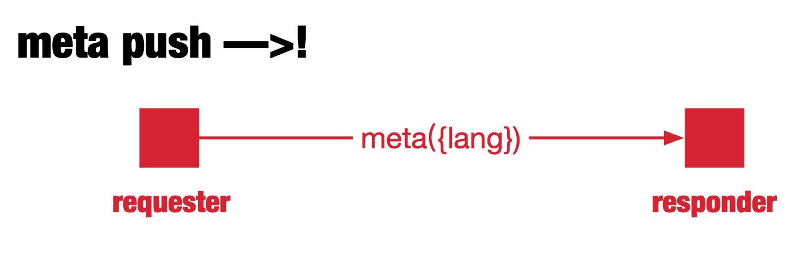

> [Reactive Manifesto](http://reactivemanifesto.org/)
> 
>  we want systems that are Responsive, Resilient, Elastic and Message Driven. We call these Reactive Systems.


# Java  

{ width=600 }

Row {data-height=240}
-------------------------------------

### Request (request —> <— response)
    
```java
Payload payload = DefaultPayload.create(JSON.toJSONString(helloRequest));
CountDownLatch c = new CountDownLatch(1);
socket.requestResponse(payload)
        .subscribe(p -> {
            HelloResponse response = JSON.parseObject(p.getDataUtf8(), HelloResponse.class);
            log.info("<< [Request-Response] response id:{},value:{}", response.getId(), response.getValue());
            c.countDown();
        });
c.await();
```

### Response (request —> <— response)
    
```java
public Mono<Payload> requestResponse(Payload payload) {
    HelloRequest helloRequest = JSON.parseObject(payload.getDataUtf8(), HelloRequest.class);
    log.info(" >> [Request-Response] data:{}", helloRequest);
    String id = helloRequest.getId();
    HelloResponse helloResponse = getHello(id);
    return Mono.just(DefaultPayload.create(JSON.toJSONString(helloResponse)));
}
```

Row {data-height=280}
-------------------------------------
{ width=600 }

Row {data-height=275}
-------------------------------------
    
### Request (request —> <— <— stream)
    
```java
List<String> ids = HelloUtils.getRandomIds(5);
Payload payload = DefaultPayload.create(JSON.toJSONString(new HelloRequests(ids)));
CountDownLatch c = new CountDownLatch(5);
socket.requestStream(payload).subscribe(p -> {
    HelloResponse response = JSON.parseObject(p.getDataUtf8(), HelloResponse.class);
    log.info("<< [Request-Stream] response id:{},value:{}", response.getId(), response.getValue());
    c.countDown();
});
c.await();
```

### Response (request —> <— <— stream)
    
```java
public Flux<Payload> requestStream(Payload payload) {
  HelloRequests helloRequests = JSON.parseObject(payload.getDataUtf8(), HelloRequests.class);
  log.info(">> [Request-Stream] data:{}", helloRequests);
  List<String> ids = helloRequests.getIds();
  return Flux.fromIterable(ids)
          .delayElements(Duration.ofMillis(500))
          .map(id -> {
              HelloResponse helloResponse = getHello(id);
              return DefaultPayload.create(JSON.toJSONString(helloResponse));
          });
}
```

Row {data-height=500}
-------------------------------------
{ width=600 }

Row {data-height=420}
-------------------------------------
    
### Request (request channel —> —> <— —> <—)
    
```java
CountDownLatch c = new CountDownLatch(TIMES * 3);

Flux<Payload> send = Flux.<Payload>create(emitter -> {
    for (int i = 1; i <= TIMES; i++) {
        List<String> ids = HelloUtils.getRandomIds(3);
        Payload payload = DefaultPayload.create(JSON.toJSONString(new HelloRequests(ids)));
        emitter.next(payload);
    }
    emitter.complete();
}).delayElements(Duration.ofMillis(1000));

socket.requestChannel(send).subscribe(p -> {
    HelloResponse response = JSON.parseObject(p.getDataUtf8(), HelloResponse.class);
    log.info("<< [Request-Channel] response id:{},value:{}", response.getId(), response.getValue());
    c.countDown();
});
c.await();
```

### Response (request channel —> —> <— —> <—)
    
```java
public Flux<Payload> requestChannel(Publisher<Payload> payloads) {
    final Scheduler scheduler = Schedulers.parallel();

    return Flux.from(payloads)
            .doOnNext(payload -> {
                log.info(">> [Request-Channel] data:{}", payload.getDataUtf8());
            })
            .map(payload -> {
                HelloRequests helloRequests = JSON.parseObject(payload.getDataUtf8(), HelloRequests.class);
                return helloRequests.getIds();
            })
            .flatMap(HelloRSocket::apply)
            .map(id -> {
                HelloResponse helloResponse = getHello(id);
                return DefaultPayload.create(JSON.toJSONString(helloResponse));
            })
            .subscribeOn(scheduler);
}
```

Row {data-height=200}
-------------------------------------
{ width=600 }

Row {data-height=160}
-------------------------------------
    
### Request (fire and forget —>!)
    
```java
HelloRequest helloRequest = new HelloRequest("1");
Payload payload = DefaultPayload.create(JSON.toJSONString(helloRequest));
socket.fireAndForget(payload).block();
```

### Response (fire and forget —>!)
    
```java
public Mono<Void> fireAndForget(Payload payload) {
    HelloRequest helloRequest = JSON.parseObject(payload.getDataUtf8(), HelloRequest.class);
    log.info(">> [FireAndForget] FNF:{}", helloRequest);
    return Mono.empty();
}
```

Row {data-height=200}
-------------------------------------
{ width=600 }

Row {data-height=160}
-------------------------------------
    
### Request (meta push —>!)
    
```java
Payload payload = DefaultPayload.create(new byte[]{}, "JAVA".getBytes());
socket.metadataPush(payload).block();
```

### Response (meta push —>!)
    
```java
public Mono<Void> metadataPush(Payload payload) {
    String metadata = payload.getMetadataUtf8();
    log.info(">> [MetadataPush]:{}", metadata);
    return Mono.empty();
}
```

- <https://github.com/feuyeux/hello-rsocket-java/blob/master/ultimate/src/main/java/org/feuyeux/rsocket/RSocketClient.java>
- <https://github.com/feuyeux/hello-rsocket-java/blob/master/ultimate/src/main/java/org/feuyeux/rsocket/ultimate/HelloRSocket.java>

# Go

# Rust

